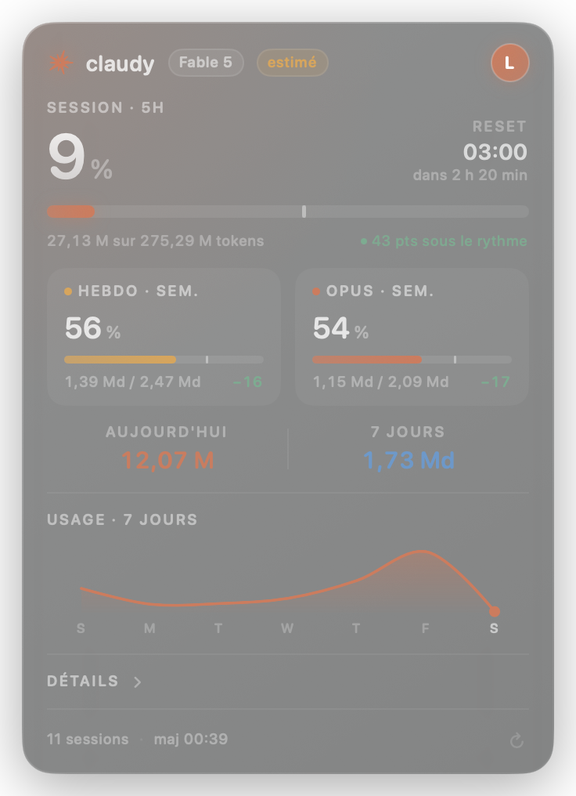

# ✳︎ Claudy

**Tes quotas Claude, en vrai, sur ton bureau.**

[](https://github.com/Endikk/Claudy/releases)
[](https://github.com/Endikk/Claudy/stargazers)
[](LICENSE)


<p align="center">
  
</p>

Widget de bureau macOS affichant ta consommation Claude : carte flottante sans bordure,
toujours au premier plan, déplaçable à la souris, en mode compact ou détaillé. Les jauges
affichent les **quotas réels de ton compte** — les mêmes chiffres que claude.ai ▸ Utilisation —
et le détail en tokens vient des transcripts locaux de Claude Code.

**Tes données restent chez toi.** Pas de télémétrie, pas de serveur tiers, aucune conversation
lue ni envoyée. Les seules requêtes réseau vont à l'API d'Anthropic, avec un jeton obtenu par
*ta* connexion. ~3 000 lignes de Swift, auditables en une heure.

## Installer

**Homebrew :**

```bash
brew tap Endikk/claudy
brew trust Endikk/claudy
brew install --cask claudy
```

Depuis Homebrew 6, `brew trust` est obligatoire pour tout tap tiers : Homebrew refuse de
charger du code d'un dépôt qui n'est pas le sien tant que tu ne l'as pas approuvé
explicitement. C'est une bonne chose — tu déclares faire confiance à ce dépôt précis.

**Ou en une commande (release précompilée) :**

```bash
curl -fsSL https://raw.githubusercontent.com/Endikk/Claudy/main/Scripts/install.sh | bash
```

L'app arrive dans `/Applications` (trouvable via Spotlight). Claudy n'est **pas notarisé** :
c'est une distribution gratuite, sans compte Apple Developer. La commande retire donc la
quarantaine posée au téléchargement — sans quoi Gatekeeper refuserait de lancer l'app. Si tu
préfères ne rien dé-quarantiner, compile toi-même (voie 2) : le code fait ~2 800 lignes,
auditables en une heure, et ne fait aucune requête réseau.

**Voie 2 — depuis les sources (nécessite Xcode) :**

```bash
git clone https://github.com/Endikk/Claudy.git
cd Claudy
./Scripts/build-app.sh --install
```

## Lancer (développement)

```bash
open Claudy.xcodeproj
```

puis ⌘R.

Cible : **macOS 13 Ventura** ou plus récent. Xcode 16 ou plus récent (groupes de fichiers
synchronisés : ajouter un `.swift` dans `Claudy/` suffit, rien à déclarer).

> Si `xcodebuild` refuse de démarrer avec
> `xcodebuild failed to load a required plug-in` / `IDESimulatorFoundation`, le contenu système
> de Xcode est plus ancien que Xcode lui-même. Corriger une fois avec :
> ```bash
> sudo xcodebuild -runFirstLaunch
> ```
> (ouvrir Xcode.app une fois et accepter l'installation des composants fait la même chose).

## Produire le .app

```bash
./Scripts/build-app.sh            # → build/Claudy.app
./Scripts/build-app.sh --install  # → /Applications/Claudy.app, puis le lance
./Scripts/build-app.sh --zip      # → dist/Claudy-<version>.zip (artefact de release)
```

Le script compile en Release via `xcodebuild` et vérifie le résultat (binaire universel
arm64 + x86_64 via `lipo`, signature via `codesign --verify`, plist via `plutil -lint`).
La version vient de `MARKETING_VERSION` dans le projet Xcode — unique source de vérité.
Le binaire est signé ad hoc — suffisant pour tourner, mais pas pour « Lancer au démarrage »
(voir plus bas).

Depuis Xcode : *Product ▸ Archive*, puis *Distribute App ▸ Copy App*.

L'app est un agent (`LSUIElement`) : pas d'icône dans le Dock, pas de barre de menus.
Tout passe par le **clic droit sur la carte** — et ⌘R / ⌘Q restent actifs quand elle a le focus.

## Utiliser

| Geste | Effet |
|---|---|
| Glisser n'importe où sur la carte | Déplacer le widget (le temps de la session — il revient en bas à droite au lancement) |
| Clic sur la bande minimale | Passer en mode complet |
| Clic droit | Rafraîchir · Mode minimal/complet · Connexion · Toujours au premier plan · Lancer au démarrage · Quitter |
| Clic sur l'avatar | Fiche compte (nom, e-mail, plan, organisation) |
| Clic sur « Détails » | Accordéon : répartition par modèle et top projets |

Rafraîchissement automatique toutes les 60 s.

## D'où viennent les données

Anthropic n'expose **aucune API publique** donnant la consommation ou le quota restant d'un
compte. La seule source disponible est locale, et c'est celle que Claudy lit :

| Donnée | Source |
|---|---|
| Tokens, modèles, projets, sessions | `<config>/projects/**/*.jsonl` — un objet `message.usage` par réponse |
| % de quota et heures de reset des jauges | `api.anthropic.com/api/oauth/usage`, avec le jeton de *ta* connexion Claudy |
| Compte, plan, organisation | `api.anthropic.com/api/oauth/profile`, repli `.claude.json` (bloc `oauthAccount`) |
| Rôle (badge Admin) | `.claude.json`, bloc `oauthAccount` |
| Nom affiché sans compte Claude | `NSFullUserName()` de la session macOS |

Invariant : les **pourcentages** des jauges viennent uniquement de l'API ; les transcripts ne
servent qu'au **détail en tokens** (totaux, répartitions, sparkline). Les deux ne sont jamais
fusionnés en un seul chiffre — sauf la ligne « X sur Y tokens », où Y est une simple échelle
d'affichage extrapolée du pourcentage.

`<config>` vaut, par ordre de priorité : le réglage `claudy.configDir`, puis `$CLAUDE_CONFIG_DIR`,
sinon `~/.claude`. La variable d'environnement ne sert qu'aux lancements depuis un terminal —
une app ouverte depuis le Finder ou le Dock n'hérite pas du shell. Pour rediriger la
configuration de façon persistante :

```bash
defaults write com.claudy.Claudy claudy.configDir ~/mon-dossier-claude
```

Quand un répertoire personnalisé est défini, aucun repli vers le dossier personnel n'a lieu :
rediriger la configuration isole complètement.

Les tokens comptés sont la somme des quatre compteurs (`input`, `output`, `cache_creation`,
`cache_read`). Les lectures de cache dominent : une semaine chargée dépasse couramment le
milliard de tokens, d'où l'unité « Md » dans l'interface.

Claude Code réécrit la même réponse sur plusieurs lignes du transcript (une par bloc de
contenu), avec un bloc `usage` identique. Claudy **déduplique** sur `(message.id, requestId)` —
la même clé que `ccusage` — sans quoi les totaux seraient gonflés d'un facteur ~2.

Le nom d'un projet vient du champ `cwd` de la ligne, jamais du nom de dossier de transcript —
celui-ci est une translittération qui perd accents et séparateurs
(`~/Documents/Développement/Ma-App` y devient `-Users-…-D-veloppement-Ma-App`).

### D'où viennent les pourcentages

**Quotas réels d'abord.** À la première ouverture, Claudy propose « Se connecter à Claude » :
une connexion OAuth standard dans ton navigateur (même mécanisme que `claude login`). Claudy
obtient ainsi **son propre jeton**, rangé dans son propre item de trousseau — il ne touche
jamais aux secrets de Claude Code, donc **aucun dialogue macOS « informations
confidentielles »**, jamais. Une fois connecté, il interroge `api.anthropic.com/api/oauth/usage`
et `/api/oauth/profile` — les mêmes points d'accès que claude.ai ▸ Réglages ▸ Utilisation. Les
trois jauges affichent alors les **pourcentages et heures de remise à zéro réels du compte**
(session 5 h, hebdo tous modèles, limite hebdo du modèle suivi — « Fable », « Opus »… selon le
compte), et la fiche compte l'identité officielle. Déconnexion à tout moment via la fiche
compte ou le clic droit.

Ce qui rend la liaison fiable :

- **Refresh autonome** : à moins de 2 min de l'expiration, Claudy rejoue lui-même le grant
  `refresh_token` et réécrit son item de trousseau. Session indépendante de celle de Claude
  Code : aucune rotation de jeton partagée.
- **Retry unique sur 401**, jamais de boucle.
- **Dernière valeur connue + backoff** : un échec (429, hors-ligne) ne remet rien à zéro — la
  dernière valeur reste affichée avec une pastille « ⟳ », et les tentatives s'espacent
  (60 s + 60 s × échecs, plafond 300 s).
- **Journal** : chaque échec est horodaté dans `~/Library/Application Support/Claudy/api.log`
  (code HTTP, refresh), pour distinguer un rate-limit d'un jeton mort.

Ces points d'accès ne sont pas documentés et peuvent changer sans préavis — fragilité assumée,
d'où le repli ci-dessous.

Le nombre de tokens du quota n'étant pas exposé, la ligne « X sur Y tokens » extrapole Y depuis
le pourcentage (Y ≈ tokens locaux ÷ %). Si d'autres appareils consomment sur le même compte,
Y est sous-estimé — le pourcentage, lui, reste exact.

**Référence personnelle en repli.** Sans connexion (bouton « Plus tard », hors-ligne), les
jauges portent une pastille « estimé » et retombent sur la consommation rapportée à une
référence calculée sur la machine :

- **Session · 5h** — 90ᵉ centile des fenêtres de 5 h déjà écoulées.
- **Hebdo · sem.** — 90ᵉ centile des journées terminées, multiplié par 7 (une semaine où chaque
  jour serait chargé). On ne compare pas des semaines entre elles : la fenêtre de rétention n'en
  contient jamais assez pour que ce soit stable.
- **Troisième jauge** — la fenêtre Sonnet, qui a son propre quota chez Anthropic. Si la machine
  n'utilise pas Sonnet, la jauge bascule sur la famille la plus consommée et prend son nom
  (« Opus · sem. »), plutôt que d'afficher une colonne morte à 0 %.

**En repli, 100 % signifie « au niveau de tes plus grosses fenêtres », pas « quota épuisé ».**

Sans historique, la consommation courante sert de référence : la jauge affiche 100 % et se
recalibre dès la première fenêtre écoulée. Les préférences `claudy.limit.*` (ci-dessous) ne
s'appliquent qu'à ce mode repli.

### Le repère de rythme

Chaque jauge porte un trait vertical : la part de sa fenêtre **déjà écoulée**. À mi-parcours
d'une session de 5 h, une consommation régulière serait pile sur le trait.

- Remplissage **à droite** du repère → consommation en avance sur l'horloge.
- Remplissage **à gauche** → sous le rythme.

Le bloc principal traduit l'écart en toutes lettres (« 15 pts au-dessus du rythme »), les
colonnes le résument à un signe (`+15` / `−14`). Sous 4 points d'écart, l'app affiche
« dans le rythme » plutôt que de qualifier d'avance le bruit d'une requête isolée. Au-delà de
20 points d'avance, le libellé passe au rouge.

Le repère disparaît quand aucune fenêtre n'est en cours — il n'y a alors pas de rythme à tenir.

Au-delà de **95 %** sur n'importe quelle jauge, la carte se **fissure** : un impact et ses
fêlures se propagent sur le verre, et le liseré vire au rouge. L'intensité monte jusqu'à 100 %.
Un signal qu'on voit du coin de l'œil, sans avoir à lire un chiffre.

Avec les quotas réels, les fenêtres hebdomadaires sont **celles d'Anthropic** : 7 jours ancrés
sur la vraie heure de remise à zéro du compte (par ex. lundi 17:00). En repli sans jeton, c'est
la **semaine calendaire** qui sert de fenêtre — elle seule donne alors un instant de remise à
zéro et donc un rythme attendu ; le premier jour suit la locale du système. L'historique, la
sparkline et les répartitions restent, eux, sur 7 jours glissants : une courbe qui repart d'un
point chaque lundi n'apprendrait rien.

Les barres de la section « Détails » n'ont volontairement pas de repère : elles expriment une
part du total, pas une durée.

Pour imposer des valeurs, trois préférences (entiers, en tokens) :

```bash
defaults write com.claudy.Claudy claudy.limit.session -int 2400000
defaults write com.claudy.Claudy claudy.limit.weekly  -int 18000000
defaults write com.claudy.Claudy claudy.limit.model   -int 9000000
```

### Mode démonstration

Sans `.claude.json` ni dossier `projects`, l'app bascule sur `DemoUsageDataSource` et **l'annonce**
par une pastille « démo » dans l'en-tête. Le jeu de démonstration ne contient rien d'identifiant :
le nom vient de la session macOS, les projets portent des noms neutres. La bascule est réévaluée
à chaque rafraîchissement — installer Claude Code après coup suffit.

Si Claude Code est présent mais sans activité sur 7 jours, l'app affiche le vrai compte avec des
compteurs à zéro : elle ne substitue pas des chiffres de démonstration à une absence d'usage.

Toute autre panne (dossier `projects` illisible, droits manquants) n'entraîne **pas** de bascule
en démonstration : le dernier relevé valide reste affiché et une pastille « erreur » (point rouge
en mode minimal) apparaît, avec le détail au survol.

## Structure

```
Claudy/
├── App/          main.swift (entrée AppKit) · AppDelegate (fenêtre, position, menu ⌘) · FloatingPanel
├── Models/       UsageSnapshot et ses composants
├── Services/     ClaudeHome (chemins) · TranscriptScanner (lecture incrémentale) ·
│                 UsageAggregator (fenêtres, références) · AccountLoader · ModelName ·
│                 UsageDataSource (protocole, source locale, bascule) · DemoUsageDataSource ·
│                 LaunchAtLogin
├── ViewModels/   UsageViewModel : état + préférences + formatage
├── Theme/        Jetons de design · pont NSVisualEffectView
└── Views/        RootView (fond, modes, menu contextuel) · MinimalView · FullView · Components/
```

### Performance

Les transcripts ne font que grossir et pèsent vite plusieurs dizaines de mégaoctets.
`TranscriptScanner` mémorise donc un décalage par fichier et ne relit que la queue ajoutée,
après avoir écarté les fichiers non modifiés dans la fenêtre et les lignes ne contenant pas
`"usage"`. Mesuré sur une machine avec 13 projets et 33 Mo de transcripts pour le seul plus gros
fichier : **2,1 s au premier scan, ~110 ms ensuite**.

### Fenêtre

Quatre points techniques valent d'être connus avant de la modifier :

- **Le point d'entrée est AppKit** (`main.swift`), pas `@main struct ClaudyApp: App`. Avec un
  cycle de vie SwiftUI, la scène résiduelle nécessaire au protocole `App` (`Settings`) entre en
  conflit avec le panneau flottant et déclenche une récursion de layout AppKit ↔ SwiftUI :
  l'app meurt en `SIGSEGV` (débordement de pile) après ~3 s. Ne pas réintroduire de scène SwiftUI.
- `FloatingPanel` **doit** surcharger `canBecomeKey` : sans ça, un panneau `.borderless`
  ne reçoit ni clavier ni menu contextuel fiable.
- La taille de la fenêtre suit la taille intrinsèque SwiftUI
  (`NSHostingController.sizingOptions = [.preferredContentSize]`). Ne pas coder de hauteur en dur.
- La carte est **ancrée par son coin bas-droit** : `setContentSize` fige le coin haut-gauche
  (croissance vers le bas), donc `AppDelegate.windowDidResize` re-suspend la carte à son ancre —
  elle grandit vers le haut et reste entièrement visible. L'ancre est réinitialisée en bas à
  droite de l'écran à chaque lancement ; un déplacement à la souris la met à jour pour la session.

## Lancement au démarrage

`SMAppService.mainApp.register()` exige une app signée avec une identité stable. Le projet est
configuré en signature ad-hoc (`CODE_SIGN_IDENTITY = "-"`) pour compiler sans compte développeur :
dans cet état, l'app détecte sa propre signature et le menu contextuel affiche l'option grisée
« indisponible — app non signée » plutôt qu'une case qui se décocherait toute seule.

**Alternative sans signature** : Réglages Système ▸ Général ▸ Ouverture et extensions ▸
Ouvrir à l'ouverture de session ▸ « + » ▸ Claudy.

Pour l'activer réellement dans l'app : sélectionner sa Team dans *Signing & Capabilities* et
repasser `CODE_SIGN_STYLE` en `Automatic`.

## Vie privée

Le réseau ne sert qu'à parler à Anthropic : la connexion OAuth initiale (dans ton navigateur,
sur claude.ai), puis `usage` (quotas), `profile` (identité du compte) et le renouvellement
standard du jeton. Rien d'autre n'est envoyé : pas de télémétrie, pas de contenu de
conversation, pas de serveur tiers. Le jeton vit dans un item de trousseau **propre à Claudy**
(« Claudy-credentials ») — les secrets de Claude Code ne sont jamais lus ni écrits, c'est
pourquoi macOS n'affiche aucun avertissement. La déconnexion supprime l'item. Sans connexion
ou hors-ligne, l'app fonctionne entièrement en local. Le sandbox est désactivé uniquement pour
permettre la lecture de `~/.claude`.

## Contribuer

Un bug, une idée, un chiffre qui ne colle pas avec claude.ai ? Ouvre une
[issue GitHub](https://github.com/Endikk/Claudy/issues) — capture d'écran et contenu de
`~/Library/Application Support/Claudy/api.log` bienvenus. Les PR sont ouvertes ; le projet est
sous licence MIT, maintenu par [@Endikk](https://github.com/Endikk).
