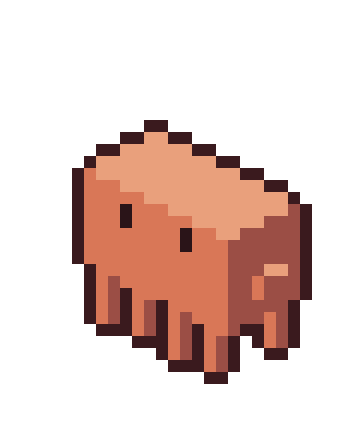

# Claudy waves hello

An animation of the mascot waving, shown when a new version is out: in the update bubble under
the menu bar item, and in place of the typing mascot until Claudy is opened.

<p align="center"></p>

## What is here

| Path | What it is |
|---|---|
| `frames/NN-name.txt` | **Source of truth.** One frame per file, one character per pixel (legend below). |
| `frames/NN-name.png` | The frame at 12 px per pixel with a 24 px transparent margin, the format of the other README GIFs. |
| `frames/NN-name@1x.png` | The frame at 1 px per pixel, 25 × 33. |
| `wave.json` | Grid size, palette, frame ids, and the playback sequence with each step's duration. |
| `claudy-wave.gif` | Every step of the sequence, looping. |
| `source/` | The scripts that produce all of the above. |

## The frames

| Id | Pose |
|---|---|
| `00-idle` | Standing, eyes open, both arms down. |
| `01-raise` | Left arm half raised. |
| `02-wave-up-hop` | Arm straight up, happy eyes (^ ^), body one pixel higher (a small hop). |
| `03-wave-left-hop` | Hand swung left, body in the hop. |
| `04-wave-up` | Arm straight up, back on the ground. |
| `05-wave-right` | Hand swung right. |
| `06-blink` | Arms down, eyes closed. |

Grid: 25 columns × 33 rows. Same scene, light and inks as the typing sprite (see
`Claudy/Views/Components/ClaudyTyping.swift`), without the desk. Claudy waves with its
**left** hand: the right one is on the shaded flank and blends into it. The hand swings across
the view (toward and away), which keeps it attached to the arm and out of the head.

## Ink legend

| Ink | Colour | Meaning |
|---|---|---|
| `.` | none | Empty |
| `C` | `#d97757` | Body, left face (the body tint) |
| `T` | `#e9a07c` | Body, top face (lit) |
| `D` | `#9b4e45` | Body, right face (shaded) |
| `o` | `#3a1a1e` | Outline |
| `E` | `#2a1418` | Eyes |
| `s` | `#00000033` | Ground shadow, 20 % black |

`C`, `T`, `D`, `o` and `E` are already inks of the app's sprite, and `ClaudyTyping.colors(for:tint:)`
derives `T`, `D` and `o` from the tint, so the waving Claudy follows the gauge colour for free.
`s` is new: it needs a colour there (semi-transparent black) before these frames go in the app.

## The sequence

From `wave.json`, about 3.3 s per loop:

1. `00-idle` 700 ms
2. `01-raise` 90 ms, `02-wave-up-hop` 110 ms
3. Two full swings, `03` `04` `05` `04` twice, then `03`, 140 ms each. Claudy hops each time
   the hand swings left
4. `02-wave-up-hop` 110 ms, `01-raise` 90 ms on the way down
5. `00-idle` 400 ms, `06-blink` 110 ms, `00-idle` 500 ms

The sequence starts and ends on `00-idle`. The GIF merges those two idle steps into one, so the
seam never shows.

**The GIF has no ground shadow.** GIF transparency is all or nothing, and a 20 % black drops to
fully transparent. The PNGs keep the shadow.

## Regenerate

```sh
cd docs/mascot/wave/source
python3 wave.py      # the isometric scene → raw.json (temporary)
python3 export.py    # raw.json → frames/, wave.json
swift make_gif.swift # frames/ + wave.json → claudy-wave.gif
python3 to_swift.py  # frames/ + wave.json → Claudy/Views/Components/ClaudyWave.swift
rm raw.json
```

`wave.py` builds the pose out of boxes on the 2:1 isometric grid (+x down-right, +y down-left,
+z up), ray-casts them into pixels, shades each face and adds the outline. Change a pose in
`boxes()`, the order and timings in `ORDER`. For a one-pixel fix, edit the `.txt` frame directly
and rebuild the PNGs and GIF from it instead (the scripts would overwrite a hand edit).

## In the app

`Claudy/Views/Components/ClaudyWave.swift` is generated by `to_swift.py`: never edit it by hand,
rerun the script. `ClaudyWaving` (in `UpdateNotice.swift`) draws it with the app's inks, cropped
to the rows the frames use (28), so it takes the typing mascot's place at the same scale. The
menu bar icon pads it to the typing sprite's width, so the percentage beside it does not move.
The ground shadow `s` is `Theme.Pixel.groundShadow`.
